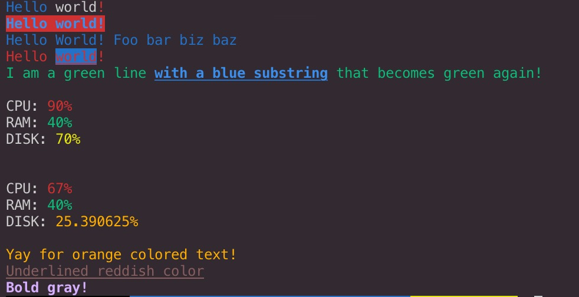
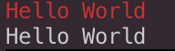

### chalk

> 美化终端的字符串样式

#### 你可以像下面这样简单的使用它

```
const chalk = require('chalk');
const log = console.log;

//将样式字符串和普通字符串合并使用
log(chalk.blue('Hello') + ' world' + chalk.red('!'));

//采用链式方法调用多个API
log(chalk.blue.bgRed.bold('Hello world!'));

//传入多个参数
log(chalk.blue('Hello', 'World!', 'Foo', 'bar', 'biz', 'baz'));

//API套用
log(chalk.red('Hello', chalk.underline.bgBlue('world') + '!'));
log(chalk.green(
    'I am a green line ' +
    chalk.blue.underline.bold('with a blue substring') +
    ' that becomes green again!'
));

//支持反引号解析字符串
log(`
CPU: ${chalk.red('90%')}
RAM: ${chalk.green('40%')}
DISK: ${chalk.yellow('70%')}
`);

let cpu = {totalPercent: 67};
let ram = {used:40, total:100};
let disk = {used: 130, total: 512}
log(chalk`
CPU: {red ${cpu.totalPercent}%}
RAM: {green ${ram.used / ram.total * 100}%}
DISK: {rgb(255,131,0) ${disk.used / disk.total * 100}%}
`);

//支持各种书写颜色的方式
log(chalk.keyword('orange')('Yay for orange colored text!'));
log(chalk.rgb(123, 45, 67).underline('Underlined reddish color'));
log(chalk.hex('#DEADED').bold('Bold gray!'));
```


#### 可以定义自己的主题

```
const chalk = require('chalk');
const log = console.log;
const error = chalk.bold.red;
const warning = chalk.keyword('orange');

log(error('Error!'));
log(warning('Warning!'));
```


#### 利用console.log字符串替换

```
const chalk = require('chalk');
const log = console.log;

const name = 'Sindre';
console.log(chalk.green('Hello %s'), name);
```

#### API

**chalk.enable:** 是否启用chalk

```
const log = console.log;
const ctx1 = new chalk.constructor({enabled: true});
log(ctx1.red('Hello World'));
const ctx2 = new chalk.constructor({enabled: false});
log(ctx2.red('Hello World'));
```


**chalk.level:**设置chalk支持的颜色

```
const ctx = new chalk.constructor({level: 0});
```

- 1.All colors disabled
- 2.Basic color support (16 colors)
- 3.256 color support
- 4.Truecolor support (16 million colors)

**chalk.supportsColor:**检测terminal支持的色值格式,直接调用的包[supports-color](https://github.com/chalk/supports-color)的stdout

```
log(chalk.supportsColor)//{ level: 2, hasBasic: true, has256: true, has16m: false }
```

#### 支持的样式和颜色

##### 样式

- `reset`
- `bold`
- `dim`
- `italic` *(Not widely supported)*
- `underline`
- `inverse`
- `hidden`
- `strikethrough` *(Not widely supported)*
- `visible` (Text is emitted only if enabled)

##### 颜色

- `black`
- `red`
- `green`
- `yellow`
- `blue` *(On Windows the bright version is used since normal blue is illegible)*
- `magenta`
- `cyan`
- `white`
- `gray` ("bright black")
- `redBright`
- `greenBright`
- `yellowBright`
- `blueBright`
- `magentaBright`
- `cyanBright`
- `whiteBright`


##### 背景色

- `bgBlack`
- `bgRed`
- `bgGreen`
- `bgYellow`
- `bgBlue`
- `bgMagenta`
- `bgCyan`
- `bgWhite`
- `bgBlackBright`
- `bgRedBright`
- `bgGreenBright`
- `bgYellowBright`
- `bgBlueBright`
- `bgMagentaBright`
- `bgCyanBright`
- `bgWhiteBright`

##### 颜色格式


- [`rgb`](https://en.wikipedia.org/wiki/RGB_color_model) - Example: `chalk.rgb(255, 136, 0).bold('Orange!')`
- [`hex`](https://en.wikipedia.org/wiki/Web_colors#Hex_triplet) - Example: `chalk.hex('#FF8800').bold('Orange!')`
- [`keyword`](https://www.w3.org/wiki/CSS/Properties/color/keywords) (CSS keywords) - Example: `chalk.keyword('orange').bold('Orange!')`
- [`hsl`](https://en.wikipedia.org/wiki/HSL_and_HSV) - Example: `chalk.hsl(32, 100, 50).bold('Orange!')`
- [`hsv`](https://en.wikipedia.org/wiki/HSL_and_HSV) - Example: `chalk.hsv(32, 100, 100).bold('Orange!')`
- [`hwb`](https://en.wikipedia.org/wiki/HWB_color_model)  - Example: `chalk.hwb(32, 0, 50).bold('Orange!')`
- `ansi16`
- `ansi256`