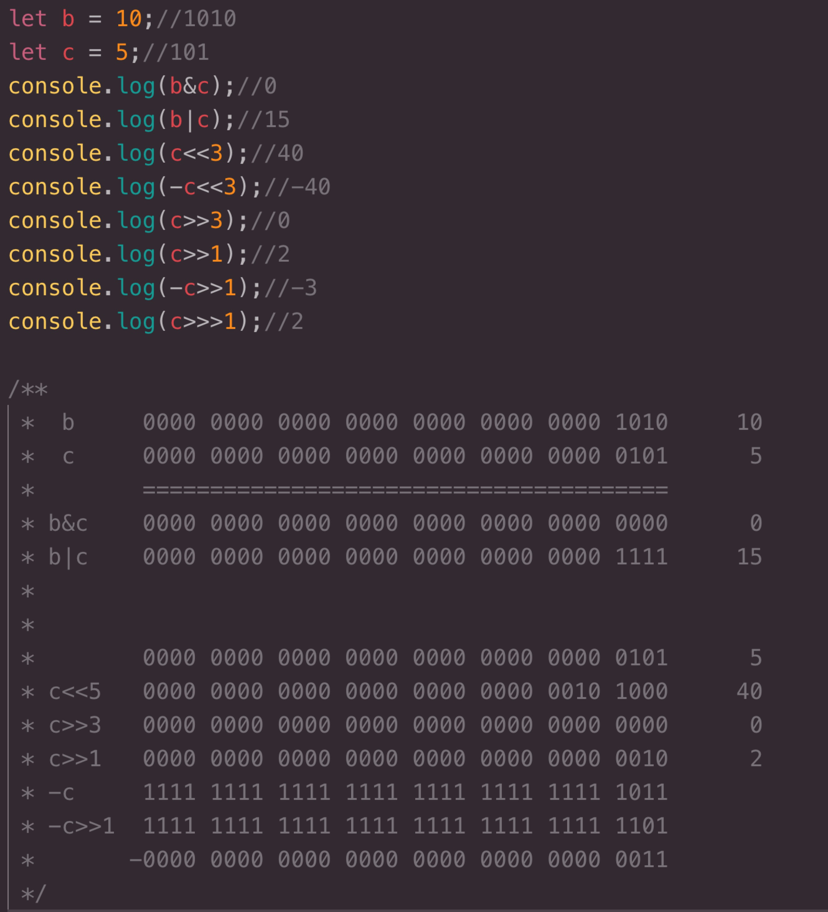

#### array-first
> 获取数组的第一项或者前几项

[文档地址:https://www.npmjs.com/package/is-sorted](https://www.npmjs.com/package/is-sorted)
```用法```：array-first(Array, 前几项)
```返回```：第一项返回arr[0] | 前几项返回数组
```默认```：返回数组第一项

#### kind-of
>判断数据类型
```用法```：kind-of(date)
```返回```：string
<table border="1" style='text-align:center'>
  <tr style='text-align:center'>
    <th style='text-align:center;background:#b2f9b2' colspan=9>数据类型</th>
  </tr>
  <tr style='background:#f9b2f5'>
    <td>January</td>
    <td>undefined</td>
    <td>null</td>
    <td>boolean</td>
    <td>string</td>
    <td>number</td>
    <td>function</td>
  </tr>
  <tr style='background:#b2d6f9'>
    <td>array</td>
    <td>regexp</td>
    <td>date</td>
    <td>arguments</td>
    <td>error</td>
    <td>buffer</td>
    <td>set</td>
  </tr>
   <tr style='background:#f9b2f5'>
     <td>weakset</td>
    <td>map</td>
    <td>weakmap</td>
    <td>symbol</td>
    <td>init8array</td>
    <td>unit8array</td>
    <td>uint8clampedarray</td>
  </tr>
  <tr style='background:#b2d6f9'>
     <td>int16array</td>
    <td>uint16array</td>
    <td>int32array</td>
    <td>uint32array</td>
    <td>float32array</td>
    <td>float64array</td>
    <td>object</td>
  </tr>
</table>

#### array-slice
>截取数组，同数组的slice方法一致
```用法```：array-slice(array, start, end)
```返回```：array
##### 源码有关位运算学习【一直不太注重位运算，重新学习下】
- **位运算NOT（~）：**```对数字求负数并且减1  ``` 
eg:  ~a = -a -1
- **位运算AND（&）：**```将两个数字的32位二进制对齐，每一位都求两者的AND运算  ``` 
- **位运算XOR（|）：**```将两个数字的32位二进制对齐，每一位都求两者的OR运算  ``` 
- **位运算左移运算（<<）：**```将数字的32位二进制左移固定位数其他位置0替补  ``` 
- **位运算有符号右移运算（>>）：**```将数字的32位二进制右移固定位数其他位置0替补  ``` 
- **位运无有符号右移运算（>>>）：**```同有符号右移正数 ``` 

